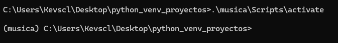
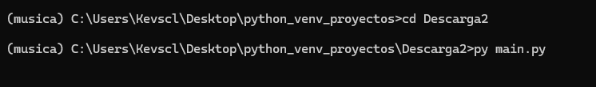

## Descarga Música & Videos con python (Yotube)

El protecto esta creado para descargar música y videos de YouTube, utilzando python y la libreria eel para la interfaz de descarga. 

 
## Comienzo 🚀

Este repositorio contiene un ambiente virtual para no instalar las librerias utilizadas.

Clonar el repositorio o descargar desde https://github.com/KevinGil12C/python_venv_proyectos.git

- Abrir el entorno virtual .\musica\Scripts\activate

- Movernos al directorio Descarga 2 y ejecutar py main.py

- Ingresar la url del video a descargar asi como elegir el formato a descargar

## Requisitos
- python 3.10

--- 
- [KevinGil12C](https://github.com/KevinGil12C/) 